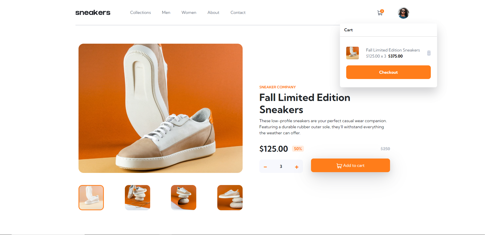
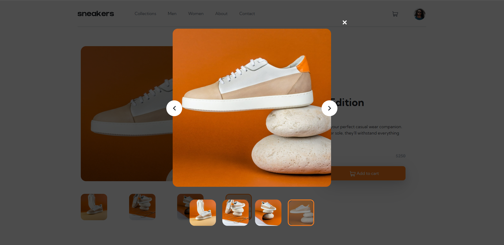

# Frontend Mentor Challange
- E-COMMERCE PRODUCT PAGE

## Table of contents

- [Overview](#overview)
  - [The challenge](#the-challenge)
  - [Screenshot](#screenshot)
  - [Links](#links)
- [My process](#my-process)
  - [Built with](#built-with)
- [Author](#author)

## Overview

### The challenge

Users should be able to:

- View the product page
- Display a slider with product images, select the image to display and enlarge it for a better view
- View a list price, a discount, and the discounted price
- Add the product to the cart, selecting the desired quantity
- View all products added by opening the cart, containing the calculated total price
- Remove the products from the cart
- View hover states for all interactive elements on the page

### Screenshot
## Desktop +1440px

# 
## Desktop Slider Open

#  
## Mobile 375px

#  
## Mobile - Menu Open

# 

### Links

- Solution URL: [GitHub Repository](https://github.com/nicolozibra1/e-commerce-product-page#desktop-slider-open)
- Live Site URL: [SNEAKERS - E-commerce Product Page](https://e-commerce-product-page-blue.vercel.app/)

## My process

I developed the website using Vue.js as a Single Page Application. I utilized Props to pass data between components and a Reactive Store (Vuex) to manage global state. The result is a responsive, modular, and easy-to-maintain interface.
### Built with

- HTML5
- CSS3
- Sass
- Bootstrap (Mobile-first workflow)
- [Vue.js](https://vuejs.org/) - JS Framework
- [Vue Tostification](https://vue-toastification.maronato.dev/) - JS Library
- [Vite](https://vitejs.dev/) - Frontend Tooling

## Author

- Website - [Coming Soon](#)
- Frontend Mentor - [@nicolozibra1](https://www.frontendmentor.io/profile/nicolozibra1)

